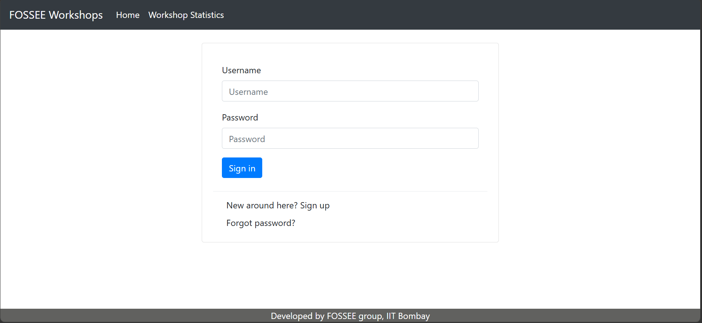
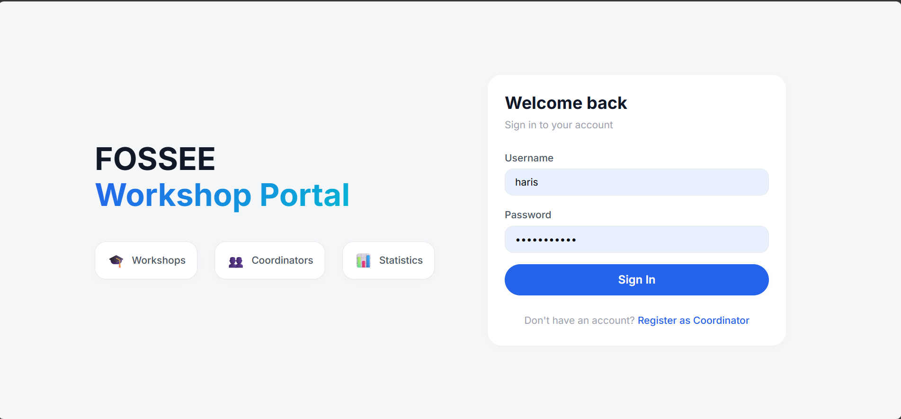
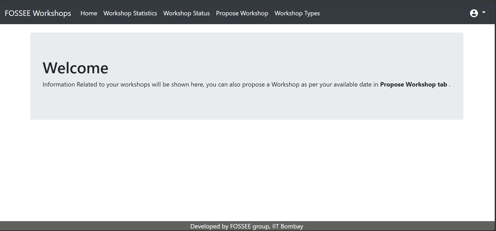
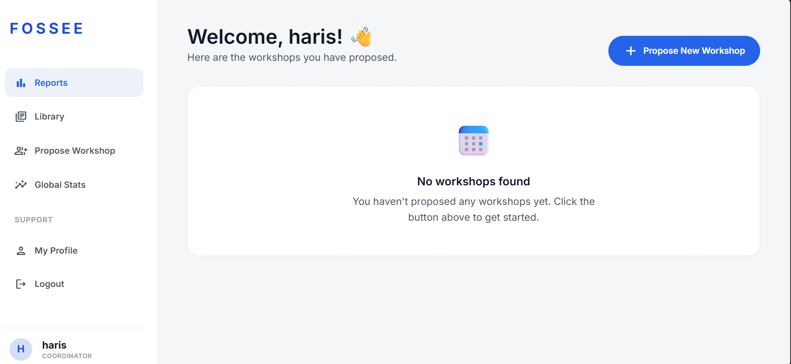
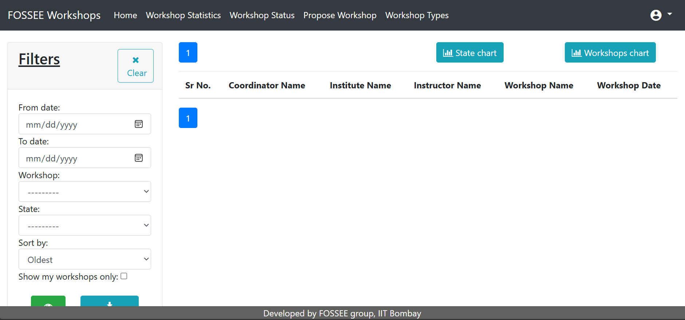
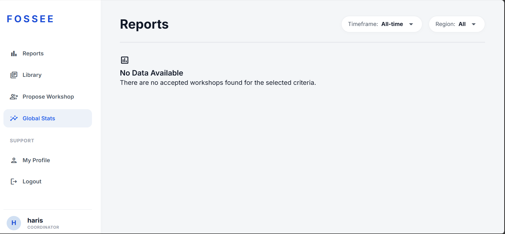
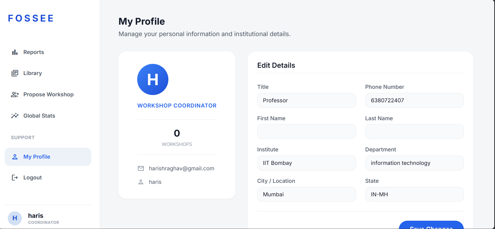
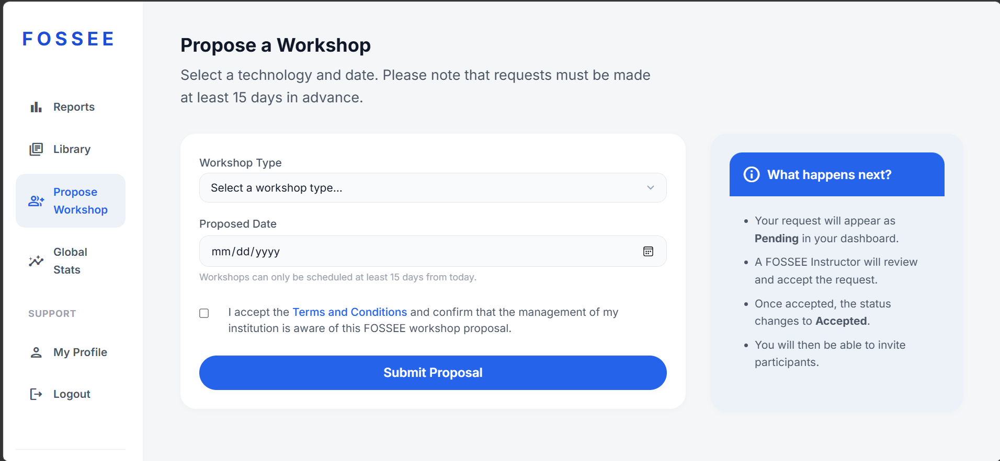

# FOSSEE Workshop Booking

## How to Start

### 1. Backend Setup (Django REST Framework)
From the project root directory:

**Create and activate virtual environment:**
```powershell
python -m venv .venv
# On Windows:
.venv\Scripts\Activate.ps1
# On Linux/macOS:
source .venv/bin/activate
```

**Install dependencies:**
```bash
pip install -r requirements.txt
```

**Database setup:**
```bash
python manage.py makemigrations
python manage.py migrate
python manage.py createsuperuser
```

**Run server:**
```bash
python manage.py runserver
```

### 2. Frontend Setup (React + Vite)
Navigate to the `frontend` directory and run:
```bash
npm install
npm run dev
```

### 3. Accessing the Website
Once both servers are running, you can view the website at:
- **Frontend**: [http://localhost:5173/](http://localhost:5173/)
- **Backend API**: [http://localhost:8000/api/](http://localhost:8000/api/)

---

### Backend Features: Django REST Framework
- Pulled out all the HTML rendering from `views.py` and replaced it with clean API endpoints.
- Built `api_views.py`, `api_urls.py`, and `serializers.py` to serve pure JSON.
- Dealt with tricky nested relations (like passing Workshop Type objects through `WorkshopSerializer`).
- Switched authentication from CSRF-heavy sessions to JWT/Token-based auth — way more scalable and fetch-friendly.

### Frontend: React + Vite
- Set up Vite for blazing-fast builds.
- Used React Router v7 for smooth client-side navigation.
- Built an `AuthContext` with ContextAPI to manage tokens globally.
- Added Axios interceptors to inject auth headers and auto-handle 401 errors (redirecting to login when needed).

### Custom Design System
I didn’t want to rely on heavy CSS frameworks. Instead, I created a lightweight design system with plain CSS variables:
- Indigo/primary color palette.
- Reusable components: `Card`, `Button`, `Input`, `Badge`, `Spinner`.
- Sticky glassmorphism Navbar + responsive Sidebar.

### Workflow Migration
Every page was rebuilt from scratch:
- **Auth**: Registration with custom dropdowns, login with error toasts.
- **Dashboards**: Role-based rendering for Instructors & Coordinators.
- **Workshop Proposal**: Sleek form for requesting workshops 15+ days in advance.
- **Comments System**: Chat-bubble style discussion inside `WorkshopDetailsPage`.
- **Statistics Dashboard**: Chart.js integration with `/api/stats/`.

---

## UI Modernization & Responsiveness

### Q&A on Design and Implementation

**1. What design principles guided your improvements?**
I prioritized a mobile-first approach and visual hierarchy to ensure that core features and primary actions remain clear on all screens. Consistency was maintained through a centralized variable system for spacing, typography, and color.

**2. How did you ensure responsiveness across devices?**
I used flexible CSS Grid and Flexbox layouts combined with a set of standardized breakpoints to handle fine-grained transitions. The navigation was re-engineered to transform from a fixed sidebar into an adaptive hamburger menu for touch devices.

**3. What trade-offs did you make between the design and performance?**
I implemented premium "glassmorphism" effects and smooth transitions using hardware-accelerated CSS properties to balance high-end aesthetics with fast rendering. Vanilla CSS was chosen over heavy frameworks to keep the project’s initial load time as low as possible.

**4. What was the most challenging part of the task and how did you approach it?**
The most challenging part was converting the persistent sidebar into a mobile-friendly slide-out menu without introducing layout shifts. I solved this by using high-performance CSS transforms and a shared React state to manage visibility seamlessly.

## ScreenShots

| Before | After |
| :---: | :---: |
| **Login Page** | **Modernized Login** |
|  |  |
| **Registration / Dashboard** | **Modernized Dashboard** |
|  |  |
| **Old Statistics** | **Modernized Reports** |
|  |  |
| **-** | **Profile Page** |
| - |  |
| **-** | **Workshop Details** |
| - |  |
